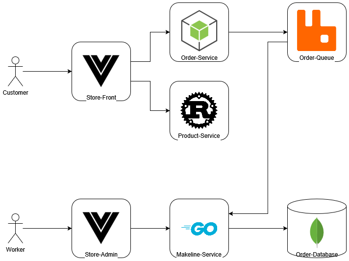

# Full-Stack Cloud-Native Development Final Project

## Architecture



## Explanation

This application is a shopping web application for Best-Buy. It allows customers to browse items, add them to their cart and submit orders. These orders can be processed by workers and sent to a database. The entire application is hosted on a Kubernetes cluster so that we can deploy the entire system easily. Kubernetes also allows the system to scale to meed demands, it allows us to scale only certain services without needing to scale every single one, this scaling can all be done automatically. 

### Store Front

The Store Front is a web application written using Vue.JS, a JavaScript framework. This is where the customers can view products, add them to their cart and send orders. 

### Product Service

The Product Service is a web API written using Rust, a very fast low level programming language. This service has a route that the Store Front uses to fetch the products in the store. This service only sends the product information and path to the image, the images themselves are stored on the Store Front Service in the public folder.

### Order Service

The Order Service is a web API written using Node.JS, a JavaScript framework. When a customer submits an order on the Store Front web application, the order is sent here. This service will send the orders over to the Order Queue

### Order Queue

The Order queue is simply a RabbitMQ implementation. It receives the orders from the order service and stores them in a queue. The orders in the queue will be fetched by the MakeLine Service and presented to the store admin in the Store Admin web application.

### Store Admin

The Store Admin is a web application written using Vue.JS, a JavaScript framework. This web application is where workers can view orders submitted bu customers, this is where they can mark orders as completed. The orders are fetched using the MakeLine Service, once the orders are marked as complete in the web interface, the MakeLine service will mark them as completed in the Order Database.

### MakeLine Service

The MakeLine Service is a web service written using GoLang. This service will fetch the order from the Order Queue and put them in the Order Database with the status set to pending. When a worker sets an order as completed in the web interface, the MakeLine Service will update the status of the order in the Order Database.

### Order Database

The Order Database is a MongoDB database, its a document database that stores JSON like documents, this makes it perfect to work with web applications because it can keep the same format as the requests. The Order Database stores every order with a status code that shows wether or not the order is completed yet. 

## Deployment Instructions

This requires: 
- Kubectl installed
- Docker installed
- A DockerHub account
- an Azure subscription
- Azure CLI installed

### Make the AKS cluster

This step takes a while to deploy, we start the deployment while we prep the rest of the system.

1. On the Azure portal, make a new resource group.
2. On the search bar search for `Kubernetes Services` and select it
    - Click on the blue create button at the center fo the screen and select `Kubernetes Cluster`
3. Add the basic information
    - Set the resource group to the one you just created
    - Name the cluster, I named mine `Native-Cluster`
    - Keep the fleet manager as `None`
    - Set the Availability zones to `None`
    - Set the AKS pricing tier to `Free`
    - Keep the Kubernetes version as `Default`
    - Set the Automatic upgrades to `Disabled`
        - Keep the Automatic upgrade scheduler to `No schedule`
    - Set the Node security channel to `None`
        - Keep the Security channel scheduler to `No schedule`
    - Keep the Authentication and Authorization to `Local accounts with Kubernetes RBAC`
4. Set the Node Pools
    - Setup the Master Node
        - Set the name of the AgentPool to `masterool`
        - Change the node size to `D2as_v4`
        - Change the Availability zones to just 1 to reduce the costs, if you wish to have a more robust system, keep them as 1,2,3
        - Set the Scale method to `Manual`
        - Set the Node count to `1`
        - Hit the update button
    - Setup the Worker Node
        - Click on the `+ Add node pool` button
        - Select `Add a Virtual Machine node pool`
        - Set the name to `workerspool`
        - Set the node size to `D2as_v4`
        - Set the node count to `1`
        - Hit the Add button
    - Click on Review and create
5. While the cluster deploys, continue to the other steps

### Clone the repos and push the Docker Images

Fork and Clone the following repos:

- https://github.com/JustinBelangerAC/store-front-L8
- https://github.com/JustinBelangerAC/store-admin-L8
- https://github.com/JustinBelangerAC/order-service-L8
- https://github.com/JustinBelangerAC/product-service-L8
- https://github.com/JustinBelangerAC/makeline-service-L8

Inside each repo run the following commands (changing the names of each service to match)

```bash
docker build -t order-service:latest .
```

Login to Docker Hub to push the images online.

```bash
docker login
```

Once you are logged in, add tags to each image (Repeat for each image while changing the names of each image)

```bash
docker tag order-service:latest <your-dockerhub-username>/order-service:latest
```

Once the image is tagged, push it to docker hub (Repeat for each image)

```bash
docker push <your-dockerhub-username>/order-service:latest
```

Inside `aps-all-in-one.yaml`, change every instance of my images to the ones you created

Once, the images are pushed to DockerHub, you do not need them on your local env. You can run this command to remove every image on your env. You will save just about 6GB of data.

```bash
docker system prune -a --volumes -f
```

### Configure the Env Vars

#### Docker Login Credentials

Inside of each Git Repo, Add the following variables in Settings > Secrets and Variables > Actions > Secrets

|            Name | Value                                                                             |
|----------------:|-----------------------------------------------------------------------------------|
| DOCKER_USERNAME | Your Docker Hub Username                                                          |
| DOCKER_PASSWORD | The password to your Docker Hub account, this is hidden, do not worry about it :) |

#### Docker Image Names

Inside of each Git Repo, Add the following variables in Settings > Secrets and Variables > Actions > Variables

|              Name | Value                                                   |
|------------------:|---------------------------------------------------------|
|    CONTAINER_NAME | The name of the container inside the yml manifest file (order-service)  |
|   DEPLOYMENT_NAME | The name of the deployment inside the yml manifest file (order-service)  |
| DOCKER_IMAGE_NAME | The name of the image uploaded to Docker Hub (order-service-final)           |

#### AKS Config

1. Login to Azure using the CLI by running the following command:

```bash
az login
```


2. Fetch the credentials for the AKS cluster
    - On the deployed cluster overview page, click on `Connect`
    - Copy the `Set the cluster subscription` command and run it on your local machine
    - Copy the `Download cluster credentials` command and run it on your local machine

3. Generate a base64-encoded Kubernetes config file
    - Run the following command on your local machine

```bash
cat ~/.kube/config | base64 -w 0 > kube_config_base64.txt
```

4. Add the Kubernetes config file to the git repo variables
    - Copy the result of the previous command
    - Inside of each Git Repo, Add the copied config to a variable called `KUBE_CONFIG_DATA` in Settings > Secrets and Variables > Actions > Secrets


#### Make Sure Every Variable is Present

Each repo should have the following variables under the secrets tab:
- `DOCKER_PASSWORD`
- `DOCKER_USERNAME`
- `KUBE_CONFIG_DATA`

Each repo should have the following variables under the Variables tab:
- `CONTAINER_NAME`
- `DEPLOYMENT_NAME`
- `DOCKER_IMAGE_NAME`

### Push to AKS

Apply the file to the AKS cluster you made before (make sure you got and applied the credentials to your local env)

```bash
kubectl apply -f ./Deployment_Files/aps-all-in-one.yaml 
```

Make sure that the pods are deploying

```bash
kubectl get pods
```

Make sure the services are running (store-front and store-admin will have public IPs for you to use them on the browser)

```bash
kubectl get services
```

## Links

|                  | Git Repo Link | Docker Hub Image Link |
|------------------|---------------|-----------------------|
| Store Front      | [Repo Link](https://github.com/JustinBelangerAC/store-front-L8)     | [Image Link](https://hub.docker.com/repository/docker/jbelangerac/store-front-final/general)            |
| Store Admin      | [Repo Link](https://github.com/JustinBelangerAC/store-admin-L8)     | [Image Link](https://hub.docker.com/repository/docker/jbelangerac/store-admin-final/general)            |
| MakeLine Service | [Repo Link](https://github.com/JustinBelangerAC/makeline-service-L8)     | [Image Link](https://hub.docker.com/repository/docker/jbelangerac/makeline-service-final/general)            |
| Order Service    | [Repo Link](https://github.com/JustinBelangerAC/order-service-L8)     | [Image Link](https://hub.docker.com/repository/docker/jbelangerac/order-service-final/general)            |
| Product Service  | [Repo Link](https://github.com/JustinBelangerAC/product-service-L8)     | [Image Link](https://hub.docker.com/repository/docker/jbelangerac/product-service-final/general)            |